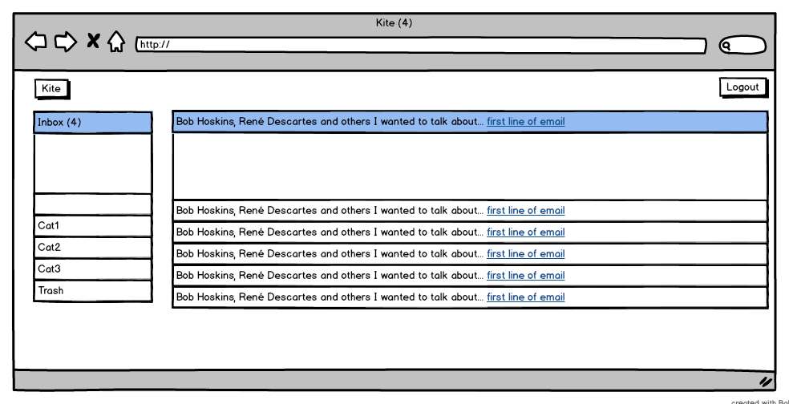
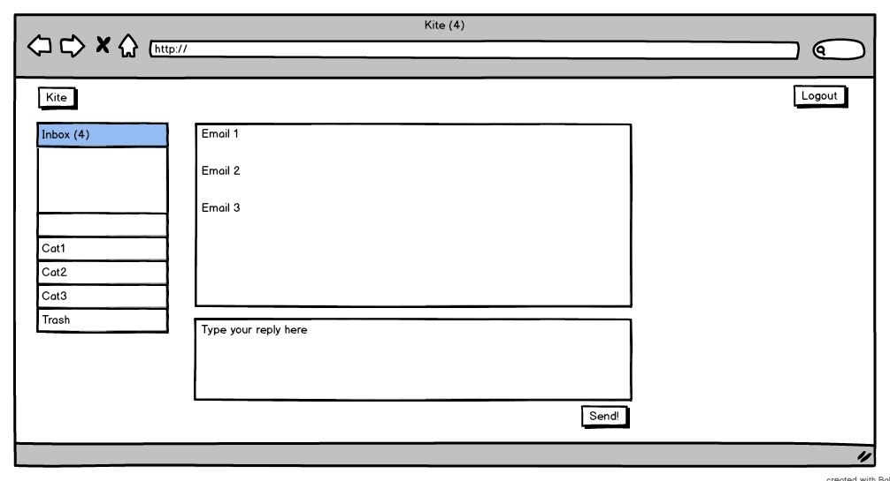

## Kite UI mini-spec

This is a very very high-level view of what Kite should look like. 

### Personas

There's two personas for this app.

Joe is an ubuntu nerd. He likes to dabble with his home linux server. He's thoughtful about privacy.

Sarah is Joe's mother. She uses email mostly to communicate with her family and to get groupon offers. 
 
### Home page

This is what you see after logging-in.

Emails are grouped by subjects.

### Thread view

If you click on a thread from the compose window, you get taken to the thread view. It shows all the emails in a thread.

There's a compose window at the to reply to the latest email in the thread.
Additionally, some magic javascript polls the server regularly and displays a notification if there's some new mail in the thread. 
